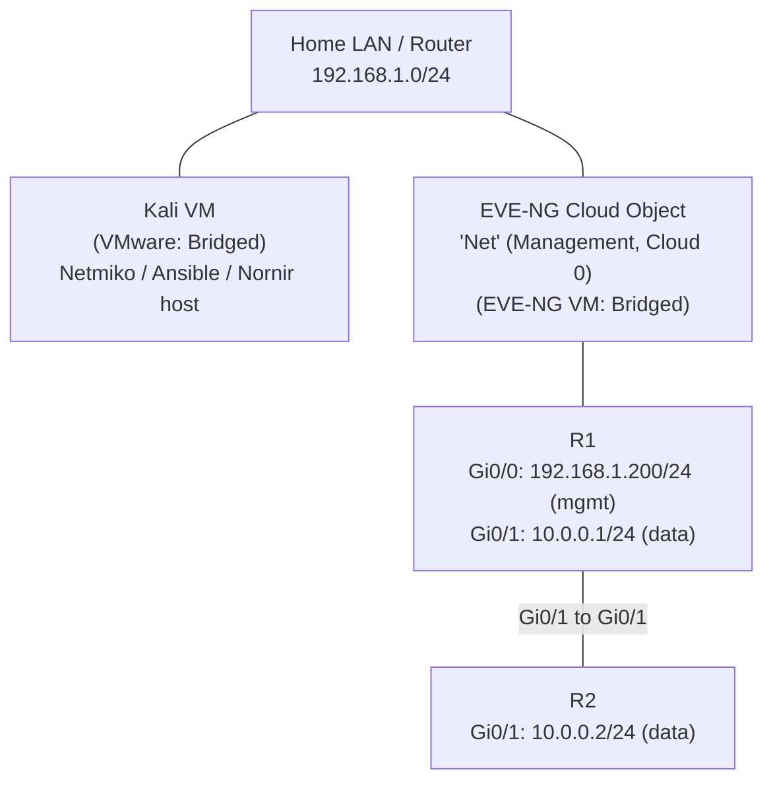

# Day 12 Lab Notes — EVE-NG + Kali Management Connectivity

**Phase:** 1 — Foundations for Automation
**Focus:** Standing up a 2-router lab and establishing a management path from Kali (automation host) to the lab devices.

## Topology

## IP Addressing

| Device | Interface | IP Address        | Network              | Purpose             |
|--------|-----------|--------------------|-----------------------|----------------------|
| R1     | Gi0/0     | 192.168.1.200/24   | Home LAN (bridged)   | Management (SSH access from Kali) |
| R1     | Gi0/1     | 10.0.0.1/24        | Lab data plane       | Router-to-router link |
| R2     | Gi0/1     | 10.0.0.2/24        | Lab data plane       | Router-to-router link |
| Kali   | eth0      | 192.168.1.x/24     | Home LAN (bridged)   | Automation host      |

## What was built

- Created a fresh EVE-NG lab with two Cisco vIOS routers (R1, R2), directly connected via Gi0/1 ↔ Gi0/1.
- Confirmed router-to-router reachability: `ping 10.0.0.2` from R1 succeeded (100% success rate).
- Added an EVE-NG **Cloud (Management)** object to the topology and attached a second interface on R1 (Gi0/0) to it, bridging the lab into the home LAN.
- Switched the Kali VM's network adapter from **NAT** to **Bridged** in VMware, so Kali sits on the same LAN segment as the EVE-NG host and the lab's management interface.
- Confirmed Kali → R1 management reachability: `ping 192.168.1.200` succeeded.

## Key troubleshooting / concept notes

**NAT vs. Bridged mismatch was the root cause of initial unreachability.**
EVE-NG's VM was Bridged (present on the home LAN), while Kali was on NAT (an isolated virtual subnet). Two VMs on different VMware network modes can't see each other directly — switching Kali to Bridged put both on the same reachable segment.

**Why `10.0.0.1` isn't pingable from Kali, even though it's on the same router as `192.168.1.200`:**
Being on the same physical router does not make all of its interfaces reachable from an arbitrary host. Each interface belongs to its own subnet. Kali only has a route to `192.168.1.0/24` (its own subnet) and a default route to the home gateway for everything else. Since neither Kali nor the home router has any route to `10.0.0.0/24` (a private lab-only subnet that exists only between R1 and R2), packets destined there never reach R1 — they get dropped at the home gateway.

**Practical takeaway:** management access (SSH/automation) and the data plane are intentionally kept on separate networks — this mirrors real production design, not just a lab quirk. Automation tooling (Netmiko, Ansible, Nornir — starting Day 14) will only ever need the management IP (`192.168.1.200`), never the data-plane addresses.

## Next steps (Day 13-16)

- [ ] Day 13: Manually SSH from Kali into R1 (`192.168.1.200`), run `show ip interface brief`, save output to a file.
- [ ] Day 14: Write first Netmiko script — connect to R1, run a show command programmatically.
- [ ] Day 15: Use Netmiko to push a config change to R1, verify with a read-back.
- [ ] Day 16: Give **R2** its own management interface (a second Gi interface into the Cloud object, e.g. `192.168.1.201`) so Netmiko can loop over both R1 and R2 independently.
